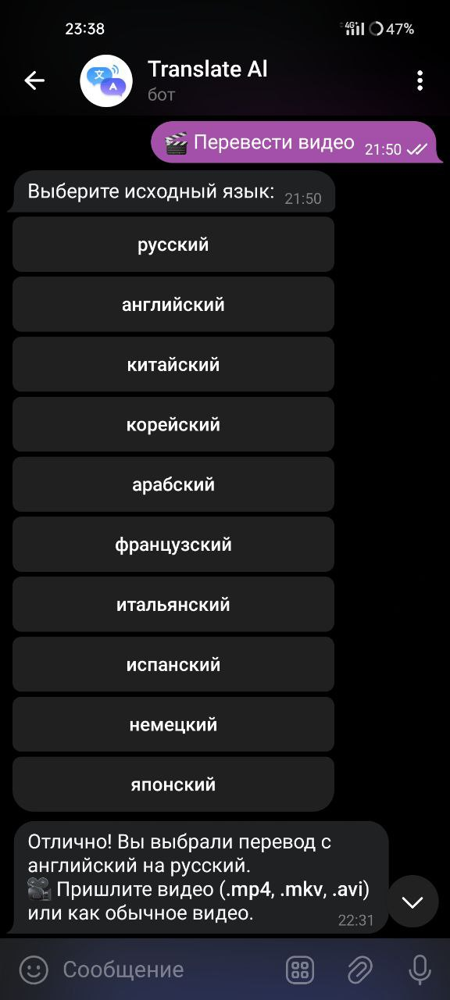
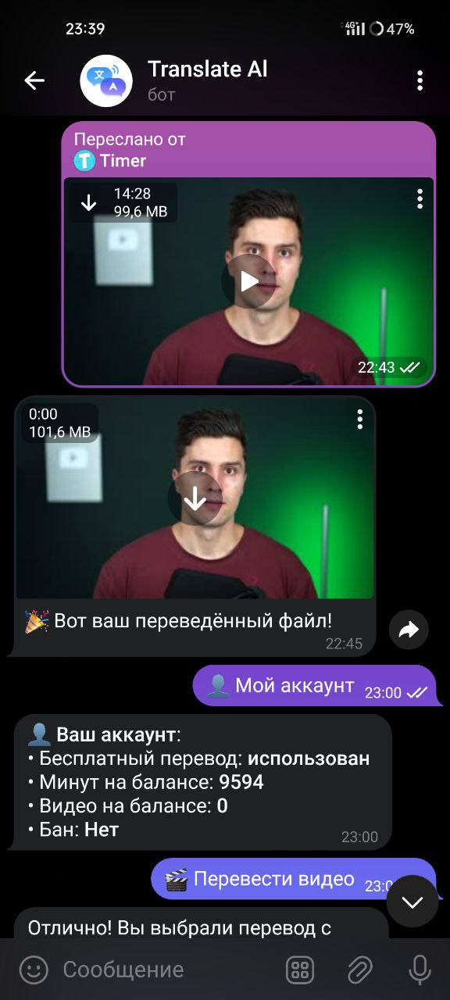

# 🎬 Telegram Video Translator Bot

> **⚠ Disclaimer:** This project was developed strictly for educational purposes. It uses Yandex Translate in a way that may violate its Terms of Use. We **do not recommend** using this project in production or public deployments.

## 📌 Описание

Это телеграм-бот, реализованный в рамках учебного проекта двумя разработчиками (вклад: 50/50). Основная задача бота — **переводить речь в видео на другой язык** с использованием Яндекс Переводчика. Итоговое видео собирается с новым аудиотреком поверх оригинального, с сохранением видеоизображения.

## 🖥️ Скриншоты и демонстрации

Бот работает полностью в автономном режиме и позволяет:

* принять видеофайл от пользователя;
* извлечь из него аудиодорожку;
* транскрибировать речь;
* перевести её на выбранный язык;
* озвучить переведённый текст;
* объединить полученное аудио с оригинальным видео;
* отправить результат пользователю.

## 🧰 Технологии

* **Язык:** Python
* **FFmpeg:** для обработки медиафайлов (извлечение аудио, объединение с видео и т.д.)
* **Yandex Translate API:** для перевода текста
* **Telegram Bot API:** для взаимодействия с пользователями
* **Systemd:** для запуска бота как системной службы
* **Docker:** частичная настройка образа (в процессе)
* **Локальный Telegram Bot Server:** использовался для тестирования

## ✅ Тестирование

Базовый функционал покрыт **юнит-тестами**, чтобы обеспечить стабильную работу:

* обработка медиафайлов
* корректность перевода
* генерация аудио
* формирование финального видео

## ⚙ Автоматизация

* В репозитории присутствует **systemd unit-файл** для запуска и управления ботом как системной службой на Linux.
* Частично настроен **Dockerfile**, в будущем проект планируется перевести на полноценный Docker-образ.

## 🚫 Юридическая оговорка

Использование Яндекс Переводчика может нарушать условия его лицензионного соглашения, так как:

* он не предназначен для автоматической массовой обработки видео,
* а также требует отдельного соглашения для коммерческого/массового использования.

**Авторы не несут ответственности** за любые последствия неправомерного использования проекта.

## 👥 Авторы

* Timer2334
* AMG
