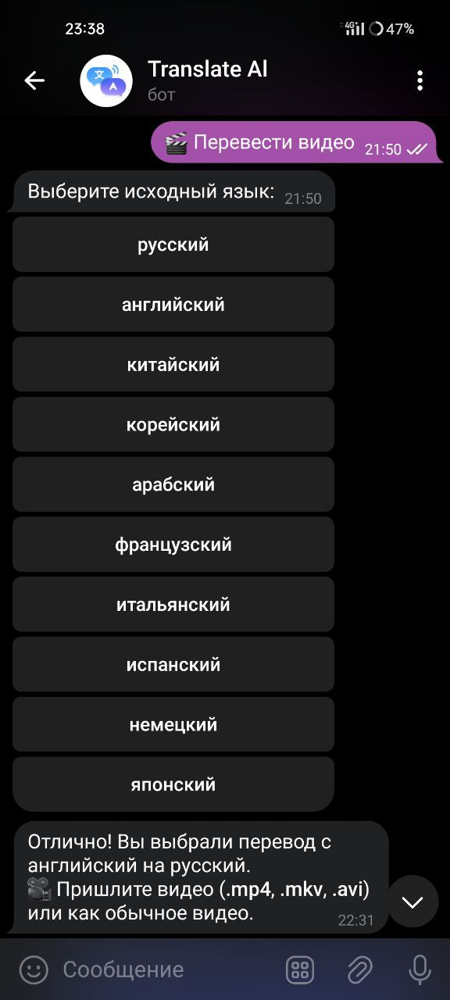
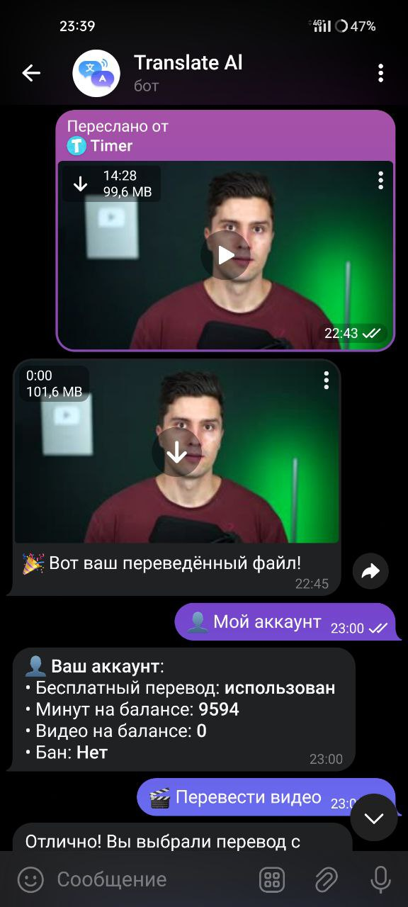

  <!-- Замените "logo.png" на реальный путь к вашему файлу логотипа -->
  
  
  # 🎬 Telegram Video Translator Bot

> **⚠ Disclaimer:** This project was developed strictly for educational purposes. It utilizes Yandex Translate in a manner that may violate its Terms of Use. We **strongly advise against** using this project in production or public deployments.

## 📌 Description

This Telegram bot is a joint educational project developed by two programmers (50/50 contribution). Its primary function is to **translate speech in videos into another language** using the Yandex Translator. The final video is compiled with a new audio track overlaying the original video, preserving the visual sequence perfectly.

## 🖼️ Demonstration

  <table>
    <tr>
      <td align="center"><b>Receiving Translation</b></td>
      <td align="center"><b>Final Result</b></td>
    </tr>
    <tr>
      <td>
        <!-- Замените пути на реальные пути к вашим скриншотам -->
        
      </td>
      <td>
        
      </td>
    </tr>
  </table>

The bot operates entirely autonomously and performs the following steps:
* Receives a video file from the user.
* Extracts the audio track from the media file.
* Transcribes the speech to text.
* Translates the text into the selected language.
* Synthesizes the translated text back into audio (Voiceover).
* Merges the newly generated audio with the original video.
* Sends the final processed video back to the user.

## 🧰 Technologies Used

* **Language:** Python
* **FFmpeg:** For media file processing (extracting audio, merging audio/video, etc.)
* **Yandex Translate API:** For text translation
* **Telegram Bot API:** For user interaction
* **Systemd:** For running the bot as a background system service
* **Docker:** Partial image configuration (work in progress)
* **Local Telegram Bot Server:** Used during the testing phase

## ✅ Testing

The core functionality is covered by **unit tests** to ensure stability:
* Media file processing
* Translation accuracy
* Audio generation
* Final video compilation

## ⚙ Automation & Deployment

* The repository includes a **systemd unit file** for launching and managing the bot as a system service on Linux.
* A **Dockerfile** is partially configured. We plan to transition the project to a fully functional Docker image in the future.

## 🚫 Legal Disclaimer

Using Yandex Translator in this manner may violate its End User License Agreement (EULA) because:
* It is not intended for automated mass video processing.
* Commercial or large-scale use requires a separate, specific agreement.

**The authors bear no responsibility** for any consequences arising from the misuse or unlawful deployment of this project.

## 👥 Authors

* **Timer2334**
* **AMG**
